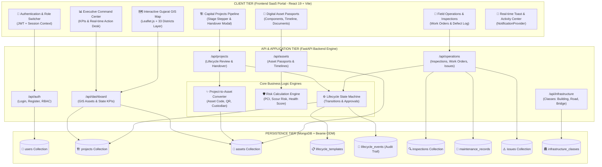
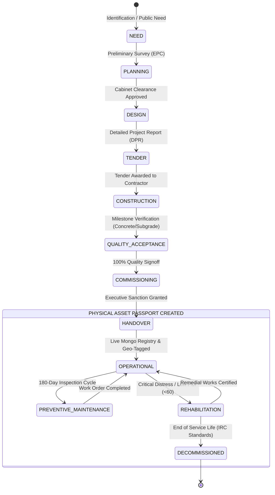
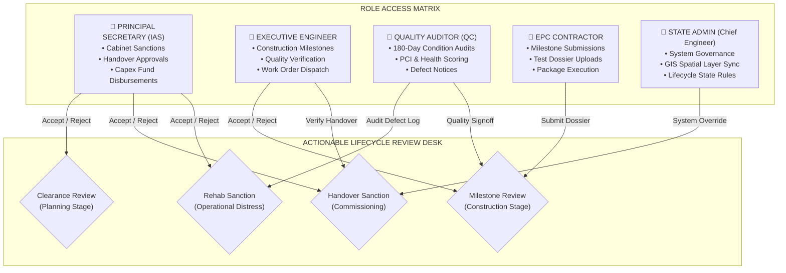
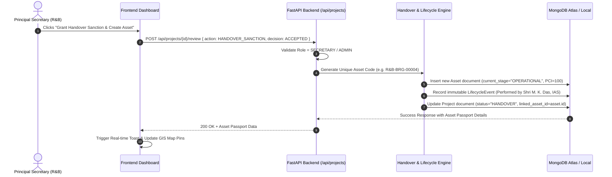
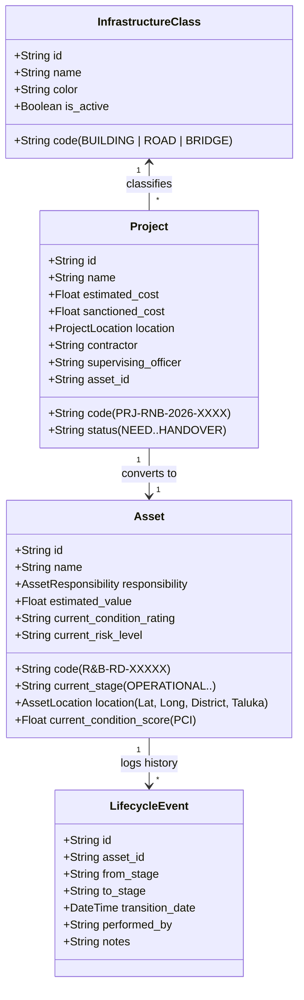

# 🏛️ PRAVI R&B — System Architecture & Workflow Specifications
### Roads & Buildings Department · Government of Gujarat

This document provides a comprehensive technical overview of the **PRAVI** (Gujarat Digital Infrastructure Lifecycle & GIS Asset Management Engine) architecture, component interactions, data pipelines, and role-based authority models.

---

## 1. High-Level 3-Tier Enterprise Architecture

---

## 2. Infrastructure Lifecycle State Machine Workflow

PRAVI bridges the gap between the **temporary construction lifecycle** and the **permanent operational asset lifecycle**:

---

## 3. Stakeholder Authority Matrix (Role-Based Access Control)

---

## 4. Automated Project-to-Asset Handover Sequence

---

## 5. GIS Spatial Infrastructure Data Model

